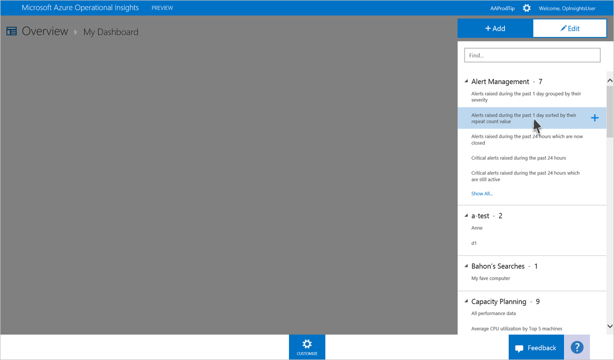
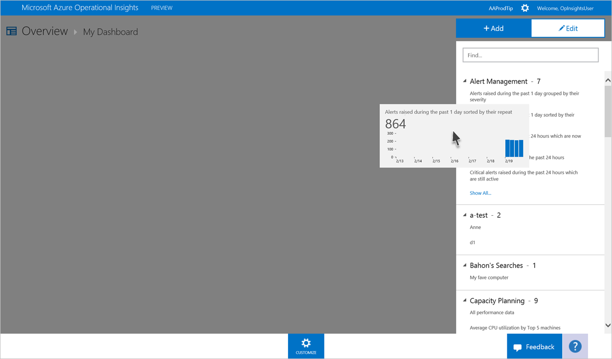
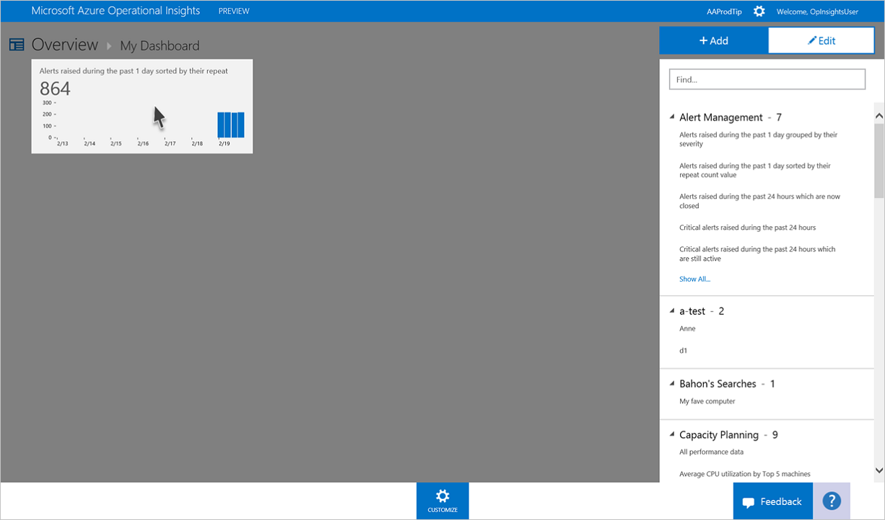
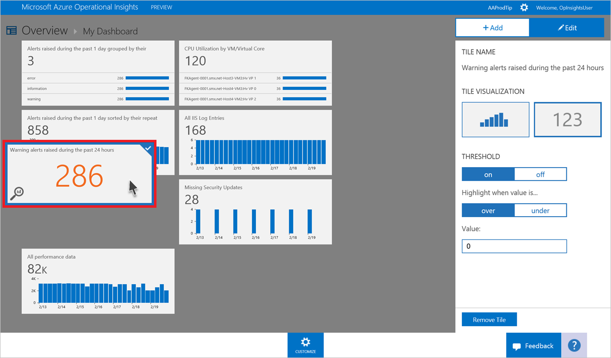
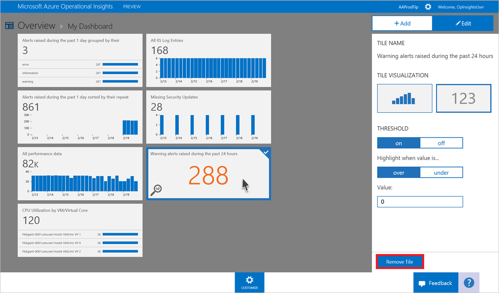

<properties
	pageTitle="Operational Insights dashboards"
	description="Informational article on basic dashboard usage for Operational Insights"
	services="operational-insights"
	documentationCenter=""
	authors="ehissey"
	manager="jwhit"
	editor=""/>

<tags
	ms.service="operational-insights"
	ms.workload="na"
	ms.tgt_pltfrm="na"
	ms.devlang="na"
	ms.topic="article"
	ms.date="05/07/2015"
	ms.author="evanhi"/>

# Operational Insights dashboards

[AZURE.INCLUDE [operational-insights-note-moms](../includes/operational-insights-note-moms.md)]

This guide helps you understand how Operational Insights Dashboards can visualize all of your saved log searches, giving you a single lens to view your environment.

## How do I create my dashboard?

To begin, go to the Azure Operational Insights Overview by clicking the Overview button on the left navigation. You'll see the "My Dashboard" tile on the left. Click it to drill down into your dashboard.

## Adding a tile

In dashboards, tiles are powered by your saved log searches. Operational Insights comes with many pre-made saved log searches, so you can begin right away. You'll see the following pictorial outlining how to begin.

In the My Dashboard view, simply click on the 'customize' gear at the bottom of the page to enter customize mode. The panel that opens on the right side of the page shows all of your workspace's saved log searches.

To visualize a saved log search as a tile, just drag it onto the empty space to the left. As you drag it will turn into a tile.

## Edit a tile

In the My Dashboard view, simply click on the 'customize' gear at the bottom of the page to enter customize mode. Click the tile you want to edit. The right panel changes to edit, and gives a selection of options:

### Tile visualizations#
There are two kinds of tile visualizations to choose from:

**Bar Chart**

This displays a timeline of your saved log search's results, or a list of results by a field depending on if your log search aggregates results by a field or not.

**Metric**

This displays your total log search result hits as a number in a tile. Metric tiles allow you to set a threshold that will highlight the tile when the threshold is reached.

### Threshold
You can create a threshold on a tile using the Metric visualization. Select on to create a threshold value on the tile. Choose whether to highlight the tile when the value is over or under the chosen threshold, then set the threshold value below.

## Organizing the dashboard
To organize your dashboard, navigate to the My Dashboard view and click on the 'customize' gear at the bottom of the page to enter customize mode. Click and drag the tile you want to move, and move it to where you want your tile to be.

## Remove a tile
To remove a tile, navigate to the My Dashboard view and click on the **customize** gear at the bottom of the page to enter customize mode. Select the tile you want to remove, then on the right panel select **Remove Tile**.

